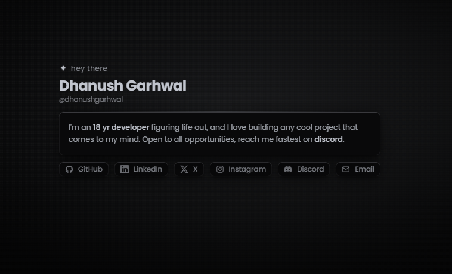

# 👋 Hey, I'm Dhanush

**This is my personal website, my little corner of the internet.**

---

## 🏠 What is this?

It's a small, dark, calm website where you can get to know me in about a minute. Who I am, what I've built, what I'm good at, and how to reach me. No clutter, no long scrolling. Just four simple pages you flip through.

---

## 🧭 What's on it?

**🏡 Home**
A short intro about me, plus round buttons to find me on my other accounts or send me an email.

**💼 Projects**
Things I've built, shown as a row of cards. The one in the middle is the one in focus. Click a side card, swipe, or use the arrow buttons to bring the next one forward.

**🧠 Skills**
A sliding strip of boxes, one for each thing I know or use. The one in the middle is the one in focus, and it's drawn big. Click a side box, swipe, or use the arrow buttons to bring the next one forward.

**⭐ Feedback**
Leave me a star rating and a message. It's completely anonymous. I never see who you are, and only I can read what you write.

---

## ✨ Little details I like

- 🎬 **A short opening animation** the first time you visit. If you come back within the hour, it skips straight to the page so you're never made to wait twice.
- 🟢 **A live status dot** in the corner that shows whether I'm online, away, busy or offline right now.
- 👀 **A view counter** at the bottom, counting how many people have stopped by. Everyone is counted once.
- 🖱️ **A custom cursor** on computers that grows over buttons and turns into a little "click" tag over project pictures.
- 🔍 **A right-click menu** with *source* and *inspect*, in case you're curious how the site was put together.
- 📵 **A friendly "No internet" screen** instead of a broken page if your connection drops, and it comes back by itself when you're online again.
- 🧱 **A clean 404 page** if you land somewhere that doesn't exist.

---

## 🎮 How to move around

| You want to... | On a computer | On a phone |
|---|---|---|
| Change page | ⬆️ ⬇️ keys, **W** / **S**, or scroll | Swipe up or down |
| Move through cards or skills | ⬅️ ➡️ keys, **A** / **D**, or scroll sideways | Swipe left or right |

---

## 🔐 My private control room

There's a hidden page, just for me, where I can change almost everything on the site without touching any of the behind-the-scenes files:

- ✏️ Edit the words on every page
- 🖼️ Swap pictures
- 🔘 Add, hide or reorder my link buttons
- 🗂️ Add or remove projects and skills, and drag them into the order I want (the top one is the one selected when the site opens)
- 💌 Read the feedback people leave, pin the good ones, delete the rest
- 🚀 Press one button to make my changes go live

Only I can get in. Nobody else can see it, open it or change anything, and it's kept out of search results.

---

## 🛡️ Keeping things safe and fair

- 🙈 Feedback is anonymous and nobody else can read it.
- 🚫 Bots and spam are filtered out. You can leave feedback a few times a day, which keeps the inbox honest.
- 🔒 My control room is locked behind my personal sign-in, and I can sign everyone out in one tap if I ever need to.
- ⚡ The site loads fast and stays smooth, even on older phones.

---

## 🖼️ A quick note on pictures

All the images (project pictures, icons, the preview you see when the link is shared) live in the `image` folder inside `public`. If a picture is missing, the site still works. It just shows a plain box with a letter instead.

---

## 📬 Say hi

The easiest way is the buttons on the home page. Or leave a star on the Feedback page, I read every one. 💛

**Made with ☕ and way too many late nights by Dhanush Garhwal**

